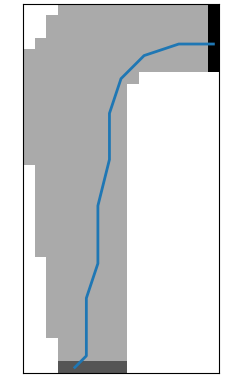
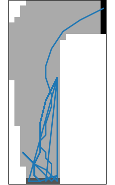

# Racetrack-path-planning-via-Reinforcement-Learning
When driving a race car around a turn, you want to go as fast as possible, but not so fast as to run off the track. Monte Carlo first-visit on policy control provides an effectively solution.

## Description
In our simplified racetrack, the car is at one of a discrete set of grid positions, the cells in the diagram. The velocity is also discrete, a number of grid cells moved horizontally and vertically per time step. The actions are increments to the velocity components. Each may be changed by +1,-1,0 in each step (9 actions). Both velocity components are within [-5,+5], and they cannot both be zero except at the starting line. Each episode begins at one of the randomly selected start states with both velocity components zero, ending with the car crossing the finishing line. The rewards are -1 for each step until the car crosses the finish line, with an exceptional -10 reward for hitting the boundaries . If the car hits the track boundary, it is moved back to a random position on the starting line, both velocity components are reduced to zero, and the episode continues . To add some noise on the actuactors, with probability 0.1 at each time step the velocity increments are both zero, independently of the intended increments.

<p align="center">
  
</p>

I compared **on-policy control** and **off-policy control**, and discuss the final choice.

---

## Project Structure
- `main.py` → main script (training, rollout, results).  
- `env.py` → environment definition (dynamics transitions, episode generation, reset).  
- `track.py` → racetrack management (CSV loader of the map, gridmap visualization).  
- `montecarlo_control.py` → control algorithm implementation (on/off policy versions).  
- `tracks/` → racetracks in CSV format.  
- `img/` → plots and figures for results.  

---

## Results

### Trajectory with the optimal policy
Examples of rollouts, with increasing number of training episodes

# Parameters
- Discount Rate: $\gamma = 1.0$
- Maximum length of each episode: $\N_steps = 1000$
- Exploration rate of the target - behaviour policy: $\epsilon = 0.10$

<p align="center">
  <figure style="display:inline-block; text-align:center; margin:10px">
    
    <figcaption>
      <ul>
      <li>**Episode length:** *1000*</li>
      <li>**Total reward:** *-2916*</li>
    </ul>
    </figcaption>
  </figure>
  <figure style="display:inline-block; text-align:center; margin:10px">
    
     <figcaption>
      <ul>
      <li>**Episode length:** *14*</li>
      <li>**Total reward:** *-13*</li>
    </ul>
    </figcaption>
  </figure>
  <figure style="display:inline-block; text-align:center; margin:10px">
    
     <figcaption>
      <ul>
      <li>**Episode length:** *49*</li>
      <li>**Total reward:** *-102*</li>
    </ul>
    </figcaption>
  </figure>
</p>


---

### Performance comparison
Comparison of average returns under the optimal policy:


- Red line: mean  
- Box: standard deviation  

---

## Reproducibility
To ensure reproducibility, a fixed **random seed** is used.  
This allows:
- Fair comparison between different experiments with the same initial conditions.  
- Clearer analysis of improvements.  

---

## Why **on-policy control**
Both **off-policy** (with Weighted Importance Sampling) and **on-policy** implementations were tested.  
However:
- Off-policy → high variance, very slow convergence. The agent can't reach the finish line even with 500k episodes. 
- On-policy ε-soft → more stable, episodic, converges in reasonable time.
  
To ensure the coverage of every (state,action) pair during the action-values Q evaluation, an ε-soft policy has been considered while acting with the environment:
- most of the time it acts greedy, accordingly to policy improvement task
- with probability $\frac{\epsilon}{|A(s)|}$ it choses an action among all (exploratory behavior)

The security of explortion has been provided through ε-soft policies, rather than the exploratory starts assumption, because of the task nature, which forces the car to start always at the starting line with zero speed; thus avoiding the possibility of starting from an arbitrarly state


👉 For this reason, the reported results are based on the **on-policy** version.

---

## ▶️ How to run
```bash
# Train with 100k episodes
python main.py --track tracks/track1.csv --episodes 100000 --epsilon 0.1 --gamma 1.0
