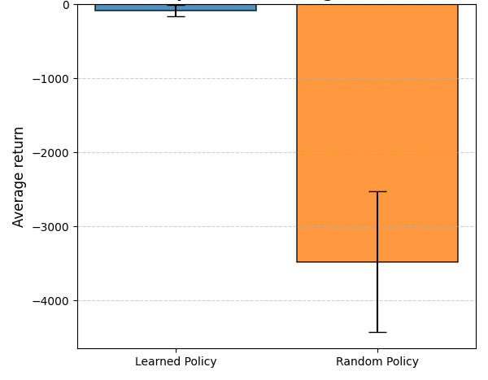

# Racetrack-path-planning-via-Reinforcement-Learning
When driving a race car around a turn, you want to go as fast as possible, but not so fast as to run off the track. Monte Carlo first-visit on policy control provides an effectively solution.

## Description
In our simplified racetrack, the car is at one of a discrete set of grid positions, the cells in the diagram. The velocity is also discrete, a number of grid cells moved horizontally and vertically per time step. The actions are increments to the velocity components. Each may be changed by +1,-1,0 in each step (9 actions). Both velocity components are within [-5,+5], and they cannot both be zero except at the starting line. Each episode begins at one of the randomly selected start states with both velocity components zero, ending with the car crossing the finishing line. The rewards are -1 for each step until the car crosses the finish line, with an exceptional -10 reward for hitting the boundaries . If the car hits the track boundary, it is moved back to a random position on the starting line, both velocity components are reduced to zero, and the episode continues . To add some noise on the actuactors, with probability 0.1 at each time step the velocity increments are both zero, independently of the intended increments.

<p align="center">
  <em>
  A couple of right turns for the racetrack task
  </em>
</p>
<p align="center">
  
</p>


In this project I applied **Monte Carlo control**, a reinforcement learning method that estimates 
action values by averaging returns over many episodes and improves the policy accordingly.  
I experimented with both the **on-policy** (ε-soft) and **off-policy** (importance sampling) versions, 
and analyzed their differences before choosing the approach best suited to this task.


---

## Project Structure
- `main.py` → main script (training, parameters tuning, rollout, results).  
- `env.py` → environment definition (dynamics transitions, episode generation, reset).  
- `track.py` → racetrack management (CSV loader of the map, gridmap visualization).  
- `montecarlo_control.py` → control algorithm implementation (on/off policy versions).  
- `tracks/` → racetracks in CSV format.  
- `img/` → plots and figures for results.  

---

## Results

### Trajectory with the optimal policy
Examples of rollouts, with increasing number of training episodes.

**Parameters**
- Discount Rate: $\gamma = 1.0$
- Maximum length of each episode: $N_{steps} = 1000$
- Exploration rate of the target - behaviour policy: $\epsilon = 0.10$

|  |  |  |
|:-----------------------:|:------------------------:|:------------------------:|
| 5000 episodes<br>**Episode length:** 1000 <br> **Total reward:** -2916 | 15000 episodes<br>**Episode length:** 14 <br> **Total reward:** -13 | 20000 episodes<br>**Episode length**: 49 <br> **Total reward:** -102 |

---

## How many episodes?

Already after about **15,000 episodes** the learned policy produces an *acceptable trajectory*, close to the optimal one.  
As shown in the **third trajectory (20,000 episodes)**, the policy does **not improve further**: it keeps an **ε-soft component**.

Because of this persistent randomness, the policy may even produce **worse trajectories** despite longer training.  
In fact, with on-policy Monte Carlo control, the best achievable solution is only within the class of **ε-soft policies**, not the truly optimal deterministic one.  

To overcome this limit, one could use an **ε-decay schedule** (reducing exploration over time).


---

### Performance comparison

To assess the quality of the learned policies, we compared the **average return** over 100 rollouts
between the learned policy and a purely random policy.

|  |  |  |
|:-----------------------:|:------------------------:|:------------------------:|
| 5000 episodes | 15000 episodes | 20000 episodes |

- The bar shows the **mean return**  
- The error bar indicates the **standard deviation** over 100 episodes  

As expected, the learned policy achieves significantly better and more stable performance than random behavior.
However, due to the ε-soft nature of the policy, a residual variance remains: sometimes the car may follow a suboptimal trajectory.

---

## Why **on-policy control**
Both **off-policy** (with Weighted Importance Sampling) and **on-policy** implementations were tested.  
However:
- Off-policy → high variance, very slow convergence. The agent can't reach the finish line even with 500k episodes. 
- On-policy ε-soft → more stable, episodic, converges in reasonable time.
  
To ensure the coverage of every (state,action) pair during the action-values Q evaluation, an ε-soft policy has been considered while acting with the environment:
- most of the time it acts greedy, accordingly to policy improvement
- with probability $\frac{\epsilon}{|A(s)|}$ it choses an action among all (exploratory behavior)

Exploration has been guaranteed through ε-soft policies, rather than the exploratory starts assumption. This is due to the task nature, which forces the car to start always at the starting line with zero speed; thus avoiding the possibility of starting from an arbitrarly state.


👉 For this reason, the reported results are based on the **on-policy** version.

---

## ▶️ How to run
```bash
# Train with 100k episodes
python main.py --track tracks/track1.csv --episodes 100000 --epsilon 0.1 --gamma 1.0
